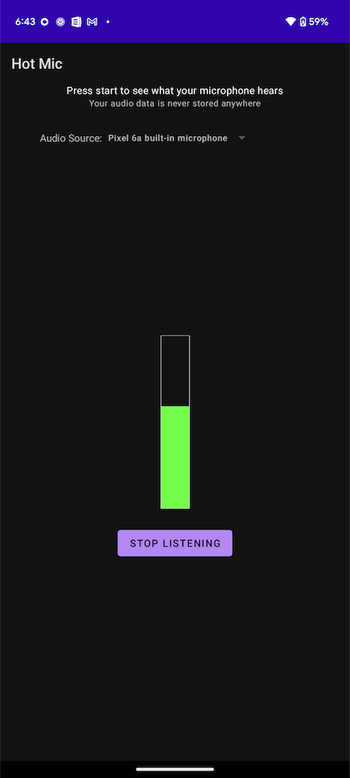

A simple [peak meter](https://en.wikipedia.org/wiki/Peak_meter) for your Android
device that allows you to pick an audio source, like a microphone, and then
visualize the loudness of the sound coming from that source. It uses recording
permissions only for displaying the audio. This app doesn't save audio anywhere.
Enjoy! 🎤🎉

The [Oboe library](https://github.com/google/oboe) is used to get low-latency
audio input.
